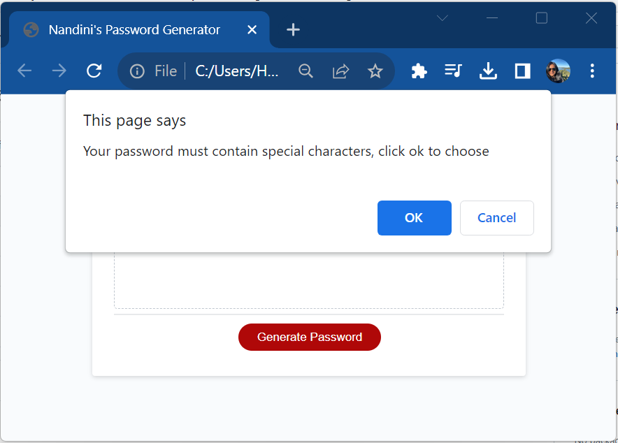
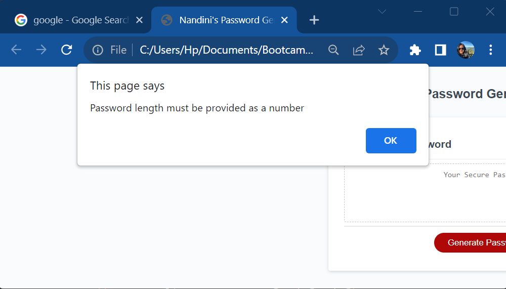

# Project Title 
"Nandini's Password Generator"

# Project Description
This website is deployed to enable users to randomly generate passwords that meet a stipulated criteria. This tool empowers users to generate a strong passwords great reducing risks of user accounts from getting hacked or taken over. 

# Coding applications used to develop the website 

The website was developed using basic HTML, CSS and JavaScript coding. 

# User story

* User clicks on "generate" button which will, prompt user with the following option; 
    - Choose the lenght of the password within a pre-set criteria of between 8 to 128 characters length 
    - Choose upper case in password
    - Choose lower case in password
    - Choose special charaters in password
    - Choose numerals in password 
* If user entered password length does not meet the required criteria the user is prompted to enter the correct length criteria once again. 
* At any point user can choose to abandon the request by clicking cancel. 
* Once all the criteria have been choose a random password is displayed for user 

# Website screenshots 

The following image shows the web application's appearance and functionality:

* If user does not choose any criteria or input an alphabet instead of a number the following error prompts are provided

# Submission 

* The URL of the deployed application.
https://nandustrings6.github.io/Password-Generator/

* The URL of the GitHub repository, with a unique name and a readme describing the project.
https://github.com/nandustrings6/Password-Generator.git

- - -
© 2023 edX Boot Camps LLC. Confidential and Proprietary. All Rights Reserved.
